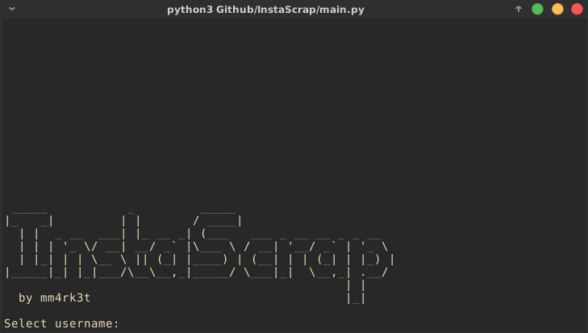

# InstaScrap

This is the README.md file for InstaScrap 0.1

Hello! I decided to release the source code of a very simple program I made myself, **InstaScraper**. The aim of the program is to get an user's **Instagram profile picture** without the need of you giving me your personal information. There is no need to log in in order to use said software.

## Acknowledgements

1. This program:

* will **ONLY** run on **Python 3.x.x**
* is licensed under the **MIT License**, you can modify it or do whatever you want as long as you don't charge anything for it.

2. The idea is not new, but I could **not** find any way to download a profile picture in higher resolution than 150x150. This program downloads them at 320x320 (it ain't much but it's honest work). So the quality would be more than twice, compared to the default ones.

## Requirements

### Python 3.x.x

* On debian-based distros:

`sudo apt-get install python3`

* Need to add other distros!

### Pip 3

* On debian-based distros:

`sudo apt-get install python3-pip`

* Need to add other distros!

### Git

* On debian-based distros:

`sudo apt-get install git`

* Need to add other distros!

### Mupdf

* On debian-based distros:

`sudo apt-get install mupdf`

* Need to add other distros!

### Instagram's API

You can follow the guide stated on the [Instagram's API repository](https://github.com/ping/instagram_private_api#Install) or  just run my **setup.sh** file as below:

`./setup.sh`

If it asks for permissions, run..

`sudo chmod+x setup.sh`

...and you will be covered.

## Installation

1. Download and extract the contents of the repository or just clone it with git
2. Run **setup.sh** (this file will install the API using git and create the directory where the pictures will be allocated)

## Basic usage

In order to use it, go to the directory where the files were downloaded and run **main.py** like this:

`python3 main.py`

You will be prompted to type a username, if it exists, it will proceed to download it on the destination folder (~/Pictures/InstaScrap), if it doesn't, it will show a warning and ask you whether you like to type the username again or exit the program. 

##### Warning!
The username that you putted in might be correct, but that doesn't mean it is the one you were searching for! Please, be sure to check the username before you put it in. It won't generate any inconvenience if you don't, but you would have lost your time.

## To do

* [ ] Make an android apk
* [ ] Be available to download feed's files (only for public profiles, for privates login is needed)
* [ ] GUI

_tested on Python 3.5.3 running Debian 9.8 (stretch)_
